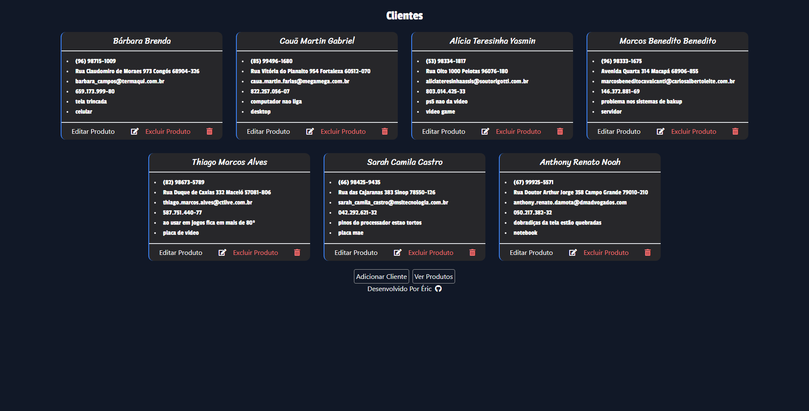

# Projeto Assistencia Tecnica Framework Spring API + Vue

Este É Um Projeto De Uma Assistência Técnica Fictícia Que Conta Com Uma Página Simples, Um Formulário Para Registro De Solicitações E Uma Pagina Com Cards Permitindo O Gerenciamento Dos Cadastros. Para O Desenvolvimento Do Projeto, Foi Aplicado o Conceito CRUD Utilizando O Framework Spring Api Para O Back-End E Vue Para O Front-End E O Layout Foi Feito Com TailwindCSS.

 

Na Imagem Acima, Podemos Observar A Página Inicial Do Site Que Apresenta Diversas Opções de Serviços Disponíveis para os Clientes. Há Um Slider Em Destaque que Exibe Alguns dos Serviços Oferecidos, Além De Cards Com Outras Opções Disponíveis. Para Solicitar um Orçamento, Há Um Formulário Disponível Para Os Clientes Preencherem.

 

Na Imagem Acima Temos A Pagina De Administração Onde O Administrador Pode Ver Todas Os Clientes Cadastrados Em Formato De Cards, Também Pode Editar E Excluir As Solicitações.

 

